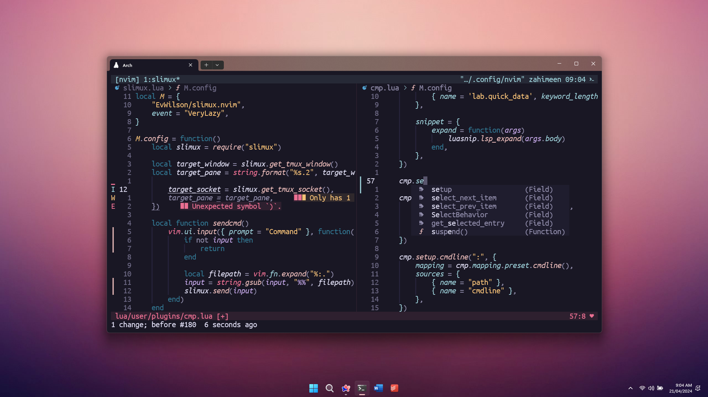

**a collection of dotfiles that reside in my home directory**
> dotfiles are configuration files (or folders) named with a .

\
the aim is to create an aesthetic and functional setup without any compromises\
my setup currently features a windows laptop using [archwsl](https://github.com/yuk7/ArchWSL)

> *wallpaper clean as ay? i stole it from [dynamicwallpaper.club](https://dynamicwallpaper.club/wallpaper/e7l5ygyw9d)*\
> *the [wallpaper](./wallpaper.jpg) in the screenshot is cropped to fit 1440p / 16:9*

## usage

i use gnu/stow to manage everything and it works pretty well imo\
however, moving to smth like ansible is in the plans

just chuck everything in your home directory and it should be fine\
*(i am not responsible for any damages you may cause to your system)*

## unlicense

not a mistake. look at the [license](./license) file

## credits

- [mvllow](https://github.com/mvllow) - Rosé Pine theme is best (i copied everything he owns)
- [chris@machine](https://github.com/ChristianChiarulli) - his [launch.nvim](https://github.com/LunarVim/Launch.nvim) livestream carried
- [ThePrimeagen](https://github.com/ThePrimeagen) - i buy my coconut oil from this guy
- [dynamicwallpaper.club](https://dynamicwallpaper.club/wallpaper/e7l5ygyw9d) - wallpaper goes hard fr (know of it cause of [mvllow](https://github.com/mvllow))
