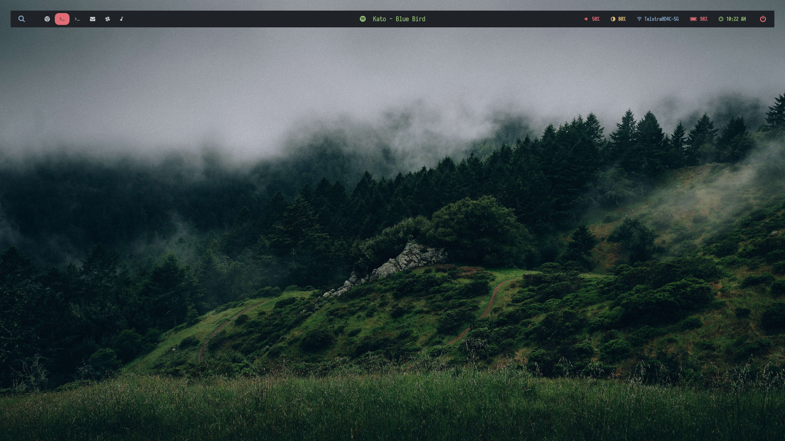
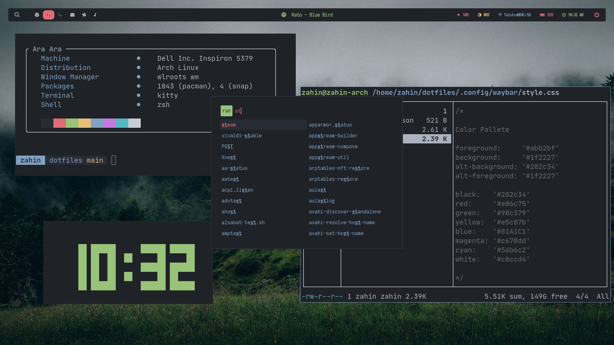
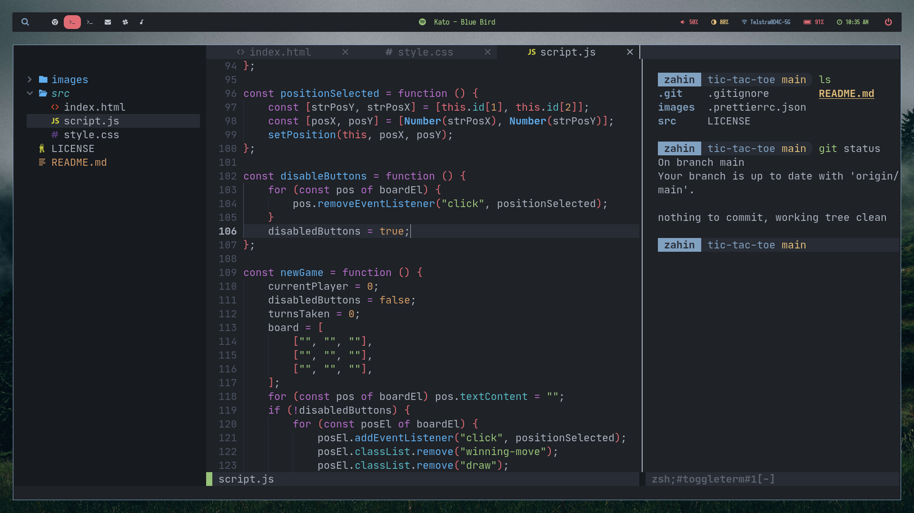

# Dotfiles

Dotfiles are any files or directories starting with a "." in their name. They are commonly configuration files for software on your computer, such as the ".vimrc" for Vim and ".config", a common directory for software to have their configurations stored. To learn more about dotfiles, I would recommend looking [here](https://medium.com/@webprolific/getting-started-with-dotfiles-43c3602fd789).

## 

## 

## 

## Programs

The Programs I Use Are:

- **Sway**\
  I use tiling window managers because they are extensible and minimal, allowing for the perfect rice. I don't want all my RAM to go to animations!
- **Waybar**\
  A sort of taskbar. It can be highly configured and works perfectly with Wayland and setups using Sway WM.
- **Kitty**\
  A highly customizable and extremely fast terminal by offloading rendering to the GPU.
- **ZSH**\
  My favourite shell which I can combine with other software to make even better, such as syntax highlighting and auto command completion.
- **Starship**\
  The prompt for my ZSH config. It is blazing fast and easy to use with other shells as well.
- **LunarVim**\
  A layer on top of Neovim to create a sort of IDE. It is perfect as it is extensible, fast and most importantly, looks good. I use this because it is too hard to keep with Neovim trends, and I am not good at configuring, so I only have to worry about the features I want.
- **Rofi**\
  A run launcher, basically something that allows you to open applications. It is kind of like _dmenu_ but has a lot less hassle in configuration. Config stolen from 'siduck76' and slightly redisigned.
- **Ranger**\
  A terminal file manager. It is pretty simple and allows image previews.
- **Macchina**\
  So have you heard of neofetch? Basically that but better and faster.
  
## Disclaimer

Anyone looking for my other rices, please look at the branches in this repo. Each rice is designated to its own branch.

## License

[The MIT License is a short and simple permissive license with conditions only requiring preservation of copyright and license notices. Licensed works, modifications, and larger works may be distributed under different terms and without source code.](LICENSE)
